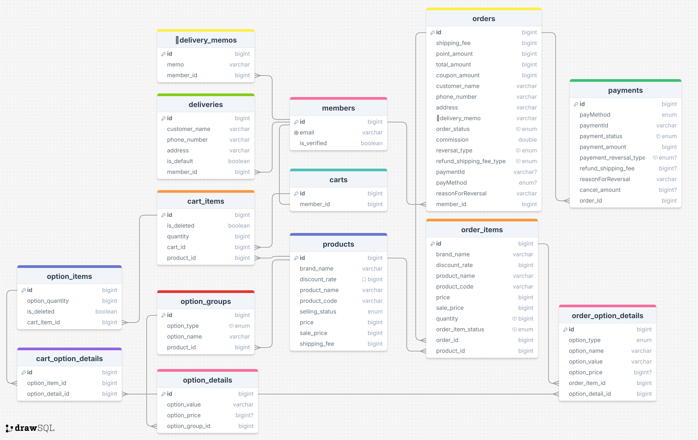

# 디어테일 Order Micro Service
기존에 MSA 구조로 설계된 디어테일 서비스에 적용하기 위해 개발된 TypeScript, NestJS를 활용한 주문 도메인 마이크로 서비스입니다. 
해당 서비스는 TDD 기반으로 개발되었으며, CQRS 패턴을 적용해 개발하였습니다. 

## 프로젝트 기능 및 설계

- **장바구니 담기 기능**
    - 회원 한 명은 하나의 장바구니를 갖습니다.
    - 상품을 장바구니에 담으면, 기존 장바구니가 있는 경우 기존 장바구니에 물건이 추가되고, 기존 장바구니가 없는 회원의 경우 장바구니가 생성된 후, 장바구니에 상품이 담깁니다.

- **장바구니 상품 수정 및 삭제 기능**
    - 장바구니 목록을 조회 후, 원하는 제품의 수량을 변경할 수 있습니다.
    - 제품 삭제의 경우, 복수 선택이 가능합니다. 

- **상품 주문 기능**
    - 회원은 장바구니에 담은 물건을 복수 선택하여 주문할 수 있습니다.
    - 회원은 상품을 장바구니에 담지 않고 바로 주문할 수 있습니다.

- **배송지 등록 기능**
    - 회원은 주문하기 페이지에서 배송지를 등록할 수 있습니다.
    - 배송지를 등록할 때 기본 배송지로 등록할 수 있습니다.
    
- **배송지 수정 및 삭제 기능**
    - 등록한 배송지 목록을 조회하여 원하는 배송지를 수정 및 삭제가 가능합니다. 

- **배송메모 저장하기 가능**
    - 최근 배송메모 조회가 가능합니다.
    - 원하는 배송 메모가 없을 경우 배송 메모를 등록할 수 있습니다.

- **결제 기능**
    - 프론트 단에서 포트원 API를 활용해 결제가 이뤄지면 배송지, 배송 메모 정보를 추가합니다.
    - 결제 내역을 PAYMENTS 테이블에 저장하고 배송 정보를 ORDERS 테이블에 업데이트 합니다.
    - 결제가 성공적으로 이뤄지거나 이뤄질 예정이면 AWS SQS를 활용해 재고를 감소시킵니다.
    
- **결제 내역 조회 기능**
    - 결제한 내역 목록을 조회할 수 있습니다.
    - 특정 결제 내역을 상세 조회할 수 있습니다.

- **환불 신청 기능**
    - 회원은 배송 완료된 상품에 한해 환불 신청을 할 수 있습니다.
    - 환불 사유에 따라 배송비가 달라집니다.
    
- **결제 취소 기능(취소/환불)**
    - 회원은 상품을 부분 취소 혹은 취소할 수 있습니다.
    - 점주는 부분 환불 혹은 환불이 신청된 상품에 한해 결제 취소를 진행할 수 있습니다.

- **주문 내역 조회 기능**
    - 회원은 주문 목록을 조회할 수 있습니다.
    - 회원은 주문 상세 내역을 조회할 수 있습니다.

## ERD

### Tech Stack
- Language: TypeScript
- Framework: NestJS, Serverless
- Runtime Built: Node.js
- DB: MySQL, TypeORM
- API Document: Swagger
- Test : Jest, PostMan
- Cloud: AWS SQS, AWS Lambda
